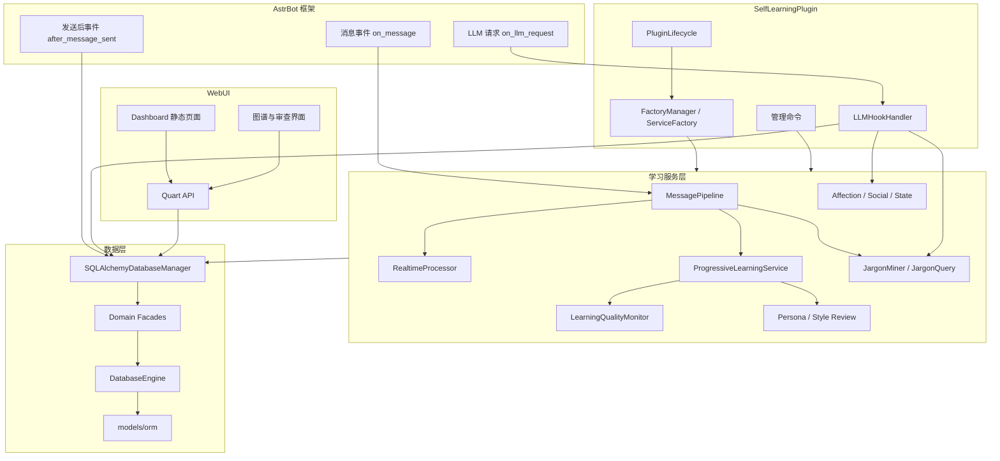
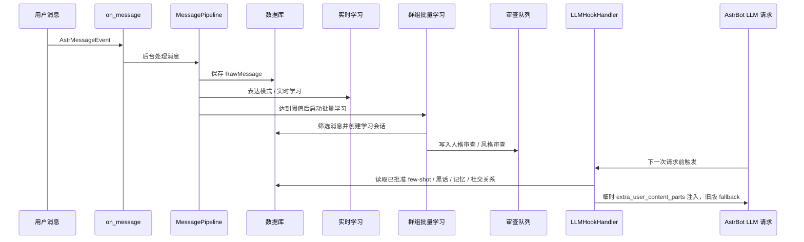
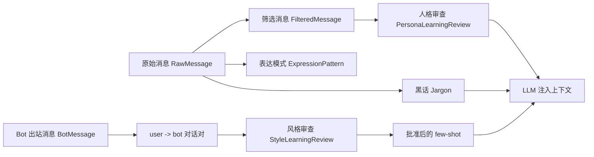

<div align="center">

**[English](README_EN.md)** | **中文**

# AstrBot 自主学习插件

让 AstrBot 在群聊中持续采集、学习、审查并注入上下文，使 Bot 逐步具备表达风格、群组黑话、社交关系、长期记忆和人格演化能力。

[](https://github.com/NickCharlie/astrbot_plugin_self_learning)
[](LICENSE)
[](https://github.com/Soulter/AstrBot)
[](https://www.python.org/)

[功能](#核心功能) · [架构](#架构总览) · [安装](#快速开始) · [WebUI](#webui-dashboard) · [文档](#开发和文档) · [社区](#社区交流)

</div>

> **版权与许可 / Copyright and License**
>
> **作者**: NickMo / Mo Zhiping (莫志平) — nickmo318@outlook.com / max318515692@gmail.com；[EterUltimate](https://github.com/EterUltimate)
>
> **维护者**: [EterUltimate](https://github.com/EterUltimate)
>
> **版权所有**: Copyright (c) 2025-2026 NickMo (Mo Zhiping). All rights reserved (for personal components).
>
> **许可协议**: 本项目采用 [**AGPL-3.0**](LICENSE) 开源协议，包含并衍生自 [AstrBot](https://github.com/AstrBotDevs/AstrBot)（同为 AGPL-3.0）。基于本仓库的修改或衍生作品必须以相同协议分发。
>
> **Author**: NickMo / Mo Zhiping — nickmo318@outlook.com / max318515692@gmail.com; [EterUltimate](https://github.com/EterUltimate)
>
> **Maintainer**: [EterUltimate](https://github.com/EterUltimate)
>
> **Copyright**: Copyright (c) 2025-2026 NickMo (Mo Zhiping). All rights reserved (for personal components).
>
> **License**: Licensed under [**AGPL-3.0**](LICENSE). This project incorporates and is a derivative work of [AstrBot](https://github.com/AstrBotDevs/AstrBot) (also AGPL-3.0). Any modifications or derivative works must be distributed under the same license.

> [!WARNING]
> 使用前请先在 AstrBot 原生人格管理中手动备份当前人格。学习、审查和回滚机制不能替代外部备份。

<details>
<summary><strong>免责声明与用户协议</strong></summary>

使用本项目即表示您已阅读、理解并同意以下条款：

1. 本项目仅供学习、研究和合法用途使用，严禁用于任何违反当地法律法规、平台服务条款或侵犯隐私的场景。
2. 使用者需在采集和处理用户消息前取得必要授权，并遵守相关数据保护要求。
3. 本项目按“原样”提供，开发者不对数据丢失、人格错误、系统崩溃或任何直接、间接损失承担责任。
4. 因用户违规使用导致的法律纠纷，由用户自行承担全部责任。
5. 本协议可能随项目更新而调整，继续使用即表示接受更新后的条款。

</details>

---

## 核心功能

| 功能 | 说明 |
| --- | --- |
| 对话风格学习 | 从真实 user -> bot 对话对中提取表达模式、few-shot 和风格审查记录 |
| 群组黑话学习 | 统计预筛高频词，结合上下文推断含义，并在 LLM 请求前注入解释 |
| 人格演化审查 | 学习结果先进入审查链路，支持批准、拒绝、删除、回滚和自动应用策略 |
| 社交关系分析 | 记录互动关系、好感度、心理状态和群组社交上下文 |
| 记忆与知识图谱 | 构建记忆图、知识图谱和可视化查询入口 |
| LLM 请求注入 | 在 `on_llm_request` 阶段注入社交、黑话、记忆、few-shot 和临时人格增量 |
| WebUI Dashboard | 提供全量设置、审查、黑话、图谱、学习内容、日志等级和指标监控 |
| 多数据库支持 | 支持 SQLite、MySQL、PostgreSQL，包含自动建表和轻量迁移 |

插件不会直接替换 AstrBot 的回复逻辑。它在消息进入、Bot 回复发送后、下一次 LLM 请求前这三个位置增强 AstrBot。

---

## 架构总览



---

## 学习链路示意





---

## 快速开始

### 安装

进入 AstrBot 插件目录：

```powershell
cd C:\path\to\AstrBot\data\plugins
git clone https://github.com/EterUltimate/self_learning_EterU.git astrbot_plugin_self_learning
```

重启 AstrBot 或在插件管理页重新加载插件。

### 依赖安装

当前代码不会在插件安装或启动阶段自动安装 pip 依赖。安装完成后，请进入 self-learning 设置页或 WebUI 系统设置，手动点击“安装依赖”。

依赖安装接口只接受设置页确认请求：

```json
{"manual_confirmed": true, "source": "system_settings"}
```

如果部署环境禁止 WebUI 安装依赖：

```powershell
$env:ASTRBOT_ENABLE_WEB_DEP_INSTALL="false"
```

### 访问 WebUI

默认地址：

```text
http://127.0.0.1:7833
```

当前 WebUI 默认免密访问。若 `web_interface_host=0.0.0.0`，局域网内可使用服务器 IP 访问。

### 基础配置顺序

1. 备份当前人格。
2. 设置学习目标：`Target_Settings.target_qq_list` 和 `target_blacklist`。
3. 设置 Provider：`filter_provider_id`、`refine_provider_id`、`reinforce_provider_id`。
4. 配置数据库：默认 PostgreSQL，会自动创建缺失数据库、schema 和表；可显式切换 SQLite 或 MySQL。
5. 按需开启表达学习、黑话学习、自动学习、记忆图和知识图谱。

Provider 未配置时插件仍可加载，但 LLM 相关功能会降级并写入日志。

---

## WebUI Dashboard

WebUI 提供以下入口：

- 总览：消息数、学习状态、待审数量、图谱数据和性能指标。
- 全量设置：读取 `/api/config/schema`，编辑所有公开配置项。
- 待审人格：批准、拒绝、删除、回滚人格学习结果。
- 风格审查：审查表达模式和 few-shot 对话。
- 黑话：查看候选词、含义、计数、群组和全局黑话同步。
- 学习内容：通过 `/api/style_learning/content_text` 查看原始消息、筛选消息、表达模式、学习批次和审查记录。
- 图谱：查看记忆图、知识图谱、社交关系图谱和分享链接。
- 日志等级：从 `error` 到 `debug` 动态调整 AstrBot 日志输出。
- 模型调用：监控筛选模型、提炼模型和强化模型调用情况，定位异常高频调用。

修改数据库类型、数据目录、WebUI host/port 后需要重启插件。日志等级和多数学习阈值可立即生效。

---

## 数据库

| 类型 | Driver | 适用场景 |
| --- | --- | --- |
| PostgreSQL | `postgresql+asyncpg` | 默认后端，长期运行、schema 隔离、多实例部署 |
| SQLite | `sqlite+aiosqlite` | 显式配置的单机回退 |
| MySQL | `mysql+aiomysql` | 显式配置的兼容后端 |

数据库层使用 SQLAlchemy async ORM。`SQLAlchemyDatabaseManager` 对外保持旧接口兼容，内部通过 Domain Facade 路由到消息、学习、黑话、人格、社交、表达、心理状态、强化学习、指标和管理等领域。

默认 PostgreSQL 启动时会先连接维护库 `postgres`，如果目标库不存在则创建 `astrbot_self_learning`，再创建缺失 schema 和 ORM 表。默认数据库用户需要具备创建数据库、schema 和表的权限。没有 PostgreSQL 服务时，可显式设置 `Database_Settings.db_type=sqlite` 回退到本地文件数据库。

自动建表会执行：

1. `Base.metadata.create_all`
2. 检查缺失表和缺失列
3. 自动创建 ORM 中存在但数据库缺失的表
4. 对已有表补齐新增列

自动迁移只做列级新增，不做字段删除、重命名或类型变更。

---

## 管理命令

所有命令需要 AstrBot 管理员权限。

| 命令 | 说明 |
| --- | --- |
| `/learning_status` | 查看学习状态和统计 |
| `/start_learning` | 手动启动学习 |
| `/stop_learning` | 停止学习 |
| `/force_learning` | 强制执行一次学习 |
| `/affection_status` | 查看好感度状态 |
| `/set_mood <类型>` | 设置 Bot 情绪 |

---

## 常见排查

### 插件加载失败：缺少依赖

确认已经通过设置页手动安装依赖。安装阶段不会自动执行 `pip install`。

### WebUI 打不开

检查：

- `enable_web_interface=True`
- 端口 `7833` 是否被占用
- AstrBot 日志中是否有 Web 服务器启动成功信息
- 修改 host/port 后是否已重启插件

### 学不到内容

按顺序检查：

1. `enable_message_capture=True`
2. 当前用户或群组未被黑名单排除
3. `RawMessage` 是否增长
4. 消息长度是否满足阈值
5. `enable_expression_patterns=True`
6. Bot 出站文本是否进入 `BotMessage`
7. 群组消息是否达到 `min_messages_for_learning`
8. 是否存在 pending 审查记录但未批准
9. Provider 是否可用

### 数据库建表失败

检查：

- 数据库驱动是否已安装
- 数据库用户是否有创建数据库、schema 和表的权限
- PostgreSQL schema 名称是否有效
- SQLite 数据目录是否可写

---

## 开发和文档

详细文档位于 [`docs/`](docs/README.md)：

- [架构与实现](docs/architecture.md)
- [学习链路](docs/learning-flow.md)
- [数据库](docs/database.md)
- [配置](docs/configuration.md)
- [WebUI API](docs/webui-api.md)
- [使用指南](docs/usage.md)
- [开发指南](docs/development.md)

关键源码入口：

- `main.py`
- `core/plugin_lifecycle.py`
- `core/factory.py`
- `services/learning/message_pipeline.py`
- `services/core_learning/progressive_learning.py`
- `services/hooks/llm_hook_handler.py`
- `services/database/sqlalchemy_database_manager.py`
- `core/database/engine.py`
- `webui/manager.py`, `webui/server.py`, `webui/app.py`

---

## 社区交流

- QQ 群：**1021544792**（ChatPlus 插件用户 + 本插件用户）
- [提交 Bug](https://github.com/NickCharlie/astrbot_plugin_self_learning/issues)
- [功能建议](https://github.com/NickCharlie/astrbot_plugin_self_learning/issues/new?template=feature_request.md)
- [贡献代码](CONTRIBUTING.md)

---

## 推荐搭配

[LivingMemory 长期记忆插件](https://github.com/lxfight-s-Astrbot-Plugins/astrbot_plugin_livingmemory)

[群聊增强插件 Group Chat Plus](https://github.com/Him666233/astrbot_plugin_group_chat_plus)

本插件负责学习、审查、黑话、表达方式和上下文注入；LivingMemory 负责长期记忆、召回和反思；Group Chat Plus 负责回复决策、读空气和回复生成。三者组合时，本插件会在检测到目标插件已加载后自动跳过本地重叠能力，避免重复记忆或重复回复。

---

## 开源协议

本项目采用 [AGPL-3.0 License](LICENSE) 开源协议。

### 特别鸣谢

- [MaiBot](https://github.com/Mai-with-u/MaiBot): 表达模式学习、知识图谱管理等核心设计思路
- [AstrBot](https://github.com/Soulter/AstrBot): 优秀的聊天机器人框架

---

<div align="center">

如果觉得有帮助，欢迎 Star、投喂支持。


[回到顶部](#astrbot-自主学习插件)

</div>
