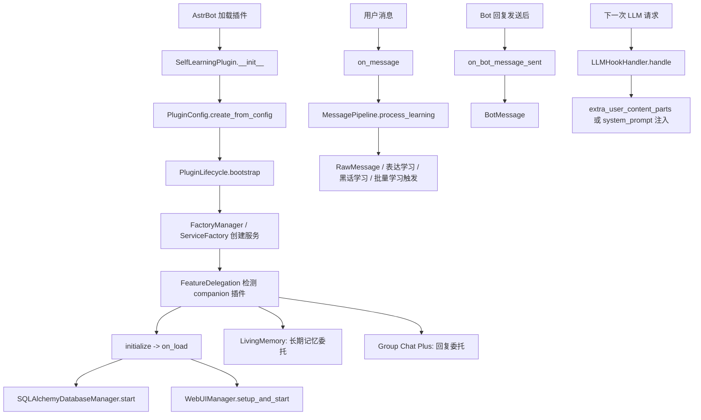

# Self Learning 文档索引

AstrBot 自主学习插件的实现文档和使用文档。

## 适用版本

- 插件名: `astrbot_plugin_self_learning`
- 展示名: `self-learning`
- 当前元数据版本: `3.2.6`
- 最低 AstrBot 版本: `4.11.4`
- 主要入口: `main.py`
- 配置入口: `_conf_schema.json`, `config.py`
- WebUI 默认端口: `7833`
- 当前代码的 WebUI 认证策略: 免密访问

## 文档列表

- [架构与实现](architecture.md): 插件从加载到关停的模块划分、生命周期和核心调用关系。
- [学习链路](learning-flow.md): 消息采集、表达学习、黑话学习、批量学习、审查和 LLM 注入全链路。
- [数据库](database.md): SQLite/MySQL/PostgreSQL 支持、ORM 表、Facade 路由、自动建表和迁移。
- [配置](configuration.md): AstrBot 配置组、运行时配置、WebUI 全量设置和重启生效项。
- [功能融合](integrations.md): LivingMemory、Group Chat Plus 的检测、委托、Dashboard 和开发 API。
- [WebUI API](webui-api.md): Dashboard 页面依赖的主要接口和返回数据用途。
- [使用指南](usage.md): 安装、依赖、基础配置、WebUI、命令和常见排查。
- [开发指南](development.md): 本地开发、测试、添加服务/接口/表、日志和提交约束。

## 核心结论

插件不是直接替换 AstrBot 的回复逻辑，而是在三个位置增强 AstrBot:

1. `event_message_type(ALL)`: 后台采集用户消息，更新学习数据。
2. `after_message_sent`: 记录 Bot 出站文本，用于提取用户到 Bot 的 few-shot 对话对。
3. `on_llm_request`: 在 LLM 请求前注入社交上下文、黑话解释、记忆/知识、few-shot 和临时人格增量。

学习结果默认先进入审查链路。人格更新和风格学习不会无条件覆盖当前人格，除非配置允许自动应用。

3.0.3 起，插件可以作为统一学习入口与协同面板。检测到 LivingMemory 时跳过本地长期记忆写入和注入；检测到 Group Chat Plus 时跳过本地回复器。本插件继续负责学习、审查、黑话、表达方式和上下文注入。

## 关键源码入口

- `main.py`: AstrBot 插件类、事件 hook、管理命令。
- `core/plugin_lifecycle.py`: 服务初始化、异步启动、关停顺序。
- `core/factory.py`: 服务工厂和轻量组件工厂。
- `core/feature_delegation.py`: LivingMemory / Group Chat Plus 检测和委托决策。
- `services/learning/message_pipeline.py`: 每条消息进入后的后台学习流水线。
- `services/core_learning/progressive_learning.py`: 批量学习、学习会话、审查记录生成。
- `services/learning/realtime_processor.py`: 实时学习和表达模式学习。
- `services/jargon/jargon_miner.py`: 黑话候选提取、验证、含义推断。
- `services/hooks/llm_hook_handler.py`: LLM 请求上下文注入。
- `services/database/sqlalchemy_database_manager.py`: 数据库 DomainRouter。
- `core/database/engine.py`: Async SQLAlchemy 引擎、建表和轻量迁移。
- `webui/services/integration_service.py`: 功能融合状态、外部面板和开发 API 列表。
- `webui/manager.py`, `webui/server.py`, `webui/app.py`: WebUI 生命周期和 Quart 应用。

## 运行链路总览

## 不纳入文档维护范围

- `coverage.xml`
- `data/`
- `vendor/`
- `.agents/`
- `skills-lock.json`

这些文件不是主线源码文档的一部分。
