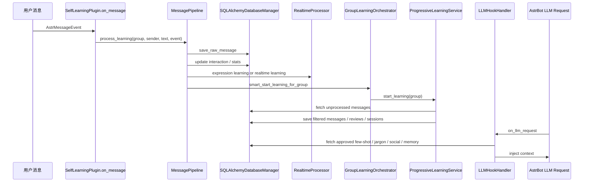

# 学习链路

学习链路由两条主线组成:

- 入站消息学习: 用户消息进入后写入数据库、提取表达模式、挖掘黑话、触发批量学习。
- 出站上下文注入: 下一次 LLM 请求前把已学习内容注入请求。

## 总链路



## 1. 消息采集

入口: `main.py::on_message`

前置条件:

- 插件未处于关停状态。
- `db_manager.engine` 已存在。
- 消息文本非空。
- `enable_message_capture=True`。
- 不是 AstrBot 命令。
- 发送者和群组未被 QQ 过滤器排除。

采集动作:

```python
await MessagePipeline.process_learning(group_id, sender_id, message_text, event)
```

`MessagePipeline` 第一步调用:

```python
await MessageCollectorService.collect_message({...})
```

`MessageCollectorService.collect_message()` 立即构造 `MessageData` 并调用:

```python
await database_manager.save_raw_message(message_obj)
```

当前实现是实时写入，不依赖内存批量缓存。

## 2. 每条消息后台流水线

入口: `services/learning/message_pipeline.py::process_learning`

步骤:

1. 保存原始消息到 `RawMessage`。
2. 更新增强交互上下文。
3. 黑话统计预筛。
4. 达到阈值时启动黑话挖掘任务。
5. 可选 V2 per-message processing。
6. 实时学习或表达模式学习。
7. 智能启动群组批量学习。
8. 可选目标驱动对话处理。

异常策略:

- 单个子步骤失败会记录日志，但不应阻断整条消息的其他学习路径。
- 黑话挖掘、表达学习等长任务通过 `asyncio.create_task()` 后台运行。
- 关停时 `cancel_subtasks()` 会取消流水线跟踪的子任务。

## 3. 表达方式学习

入口: `services/learning/realtime_processor.py`

触发条件:

- `enable_expression_patterns=True`
- 消息长度在 `message_min_length` 和 `message_max_length` 之间。
- 消息不是空白、无意义短语或常见低信息回复。
- 当前群组原始消息数至少 5 条。

处理流程:

1. 读取最近 25 条原始消息。
2. 过滤过短、过长、纯 at 后无内容的消息。
3. 合并最近 Bot 出站消息，形成时间线。
4. 延迟创建 `ExpressionPatternLearner`。
5. 调用 `trigger_learning_for_group(group_id, message_data_list)`。
6. 读取最新表达模式。
7. 将表达模式临时注入 `begin_dialogs`。
8. 生成 few-shot 对话内容。
9. 创建风格学习审查记录。

表达模式来自真实 user -> bot 邻接对，不再依赖 LLM 对表达方式做二次生成。

## 4. Bot 出站消息记录

入口: `main.py::on_bot_message_sent`

处理:

1. 读取 AstrBot 发送结果。
2. 仅提取 `Plain` 文本。
3. 保存到 `BotMessage`。

用途:

- 表达学习时与用户消息合并。
- 提取 user -> bot few-shot。
- 支撑 WebUI 查看具体学习内容。

## 5. 黑话学习

入口:

- 统计预筛: `services/jargon/jargon_statistical_filter.py`
- 挖掘器: `services/jargon/jargon_miner.py`
- 查询注入: `services/jargon/jargon_query.py`

触发条件:

- `enable_jargon_learning=True`
- 群组原始消息总数至少 10。
- 同一群组每新增 10 条消息最多触发一次。
- 同一群组已有挖掘任务运行时不重复启动。

挖掘流程:

1. `JargonStatisticalFilter.update_from_message()` 低成本统计候选词。
2. `MessagePipeline.mine_jargon()` 读取最近 30 条原始消息。
3. 优先使用统计候选，跳过 LLM 候选提取。
4. 没有统计候选时使用 LLM 从聊天片段中提取候选。
5. 使用一次 LLM 批量验证候选是否可能为黑话。
6. 保存或更新 `Jargon` 记录。
7. 在计数达到 `3, 6, 10, 20, 40, 60, 100` 时触发含义推断。

含义推断三步:

1. 基于上下文推断含义。
2. 仅基于词条推断含义。
3. 对比两次推断。如果差异明显，判定为需要群组语境才能理解的黑话。

LLM 注入时只注入解释，不要求 Bot 主动复读或扩散黑话。

## 6. 群组批量学习

入口:

- `services/learning/group_orchestrator.py`
- `services/core_learning/progressive_learning.py`

触发条件:

- `enable_style_learning=True`
- `enable_auto_learning=True` 时自动延迟启动。
- 群组未处理消息数达到 `min_messages_for_learning`。
- 距离上次学习超过 `learning_interval_hours`。
- QQ 白名单/黑名单允许该群组。

批量学习流程:

1. 创建 `LearningSession`。
2. 获取当前群组未处理消息。
3. 筛选消息并保存到 `FilteredMessage`。
4. 获取当前人格。
5. 构造轻量 `AnalysisResult`。
6. 调用 `LearningQualityMonitor.evaluate_learning_batch()`。
7. 调用 `_apply_learning_updates()`。
8. 保存学习性能记录。
9. 标记原始消息为已处理。
10. 更新学习会话统计。
11. 可选调用 system prompt 增量更新回调。

当前实现中，批量学习的人格生成部分偏保守: 默认不直接用 LLM 生成完整新人格，而是把学习结果写入审查和学习记录。

## 7. 人格审查和风格审查

主要表:

- `PersonaLearningReview`
- `StyleLearningReview`
- `ExpressionPattern`

风格学习记录规则:

- 提取到有效 few-shot 或表达模式时，状态为 `pending`。
- 没有有效对话对时，可自动标记为 `approved`，并写入说明。

人格学习记录规则:

- 重新学习模式会尽量创建审查记录。
- 正常模式只有检测到人格内容变化时创建审查记录。
- 审查记录包含原始人格、增量内容、完整新人格、置信度和元数据。

WebUI 通过统一人格审查接口处理传统人格更新、渐进式人格学习、风格学习等来源。

## 8. LLM 请求注入

入口: `services/hooks/llm_hook_handler.py::handle`

并行获取:

- 社交关系、好感度、心理状态、行为建议。
- V2 知识和记忆上下文。
- 回复多样性提示。
- 黑话理解解释。
- 已批准 few-shot。
- 当前会话临时人格增量。

注入优先级:

1. 使用 `req.extra_user_content_parts.append(TextPart(...))`。
2. 如果当前 AstrBot 版本不支持，回退追加 `req.system_prompt`。

注入内容会包在 `<context>...</context>` 中。这样可以保持系统提示相对稳定，降低对 LLM prefix cache 的影响。

## 9. 学习无法进行时的定位顺序

1. `enable_message_capture` 是否开启。
2. WebUI 或 AstrBot 配置中目标 QQ 和黑名单是否排除了当前消息。
3. 数据库是否启动成功，`RawMessage` 是否增长。
4. `message_min_length` 和 `message_max_length` 是否过滤掉了消息。
5. `enable_expression_patterns` 是否开启。
6. Bot 出站消息是否进入 `BotMessage`，否则 few-shot 对话对不足。
7. `enable_style_learning` 和 `enable_auto_learning` 是否开启。
8. 群组未处理消息数是否达到 `min_messages_for_learning`。
9. `learning_interval_hours` 是否尚未到期。
10. Provider 是否可用，LLM 相关黑话推断和 V2 检索是否失败。
11. WebUI 审查列表是否存在 pending 记录但未批准。

## 10. 关键日志

日志等级由 `Advanced_Settings.log_level` 控制:

- `error`: 只输出错误。
- `warning`: 输出警告和错误。
- `info`: 输出主要学习事件。
- `debug`: 输出详细链路、注入耗时、候选过滤和上下文状态。

WebUI 设置页可更新日志等级，`ConfigService.update_config()` 会调用 `apply_astrbot_log_level()` 立即生效。
